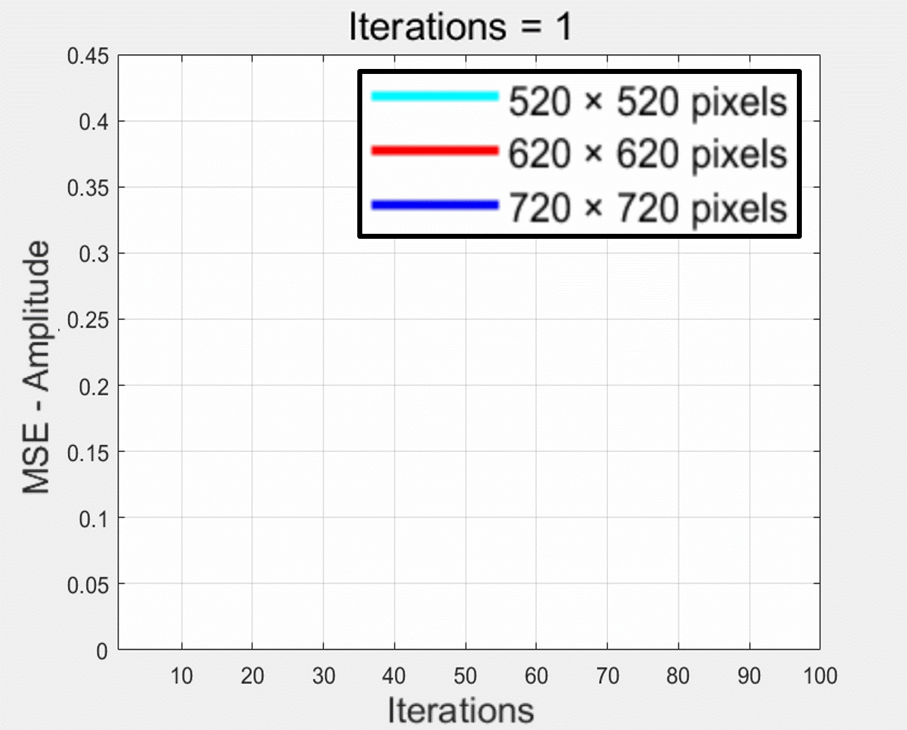
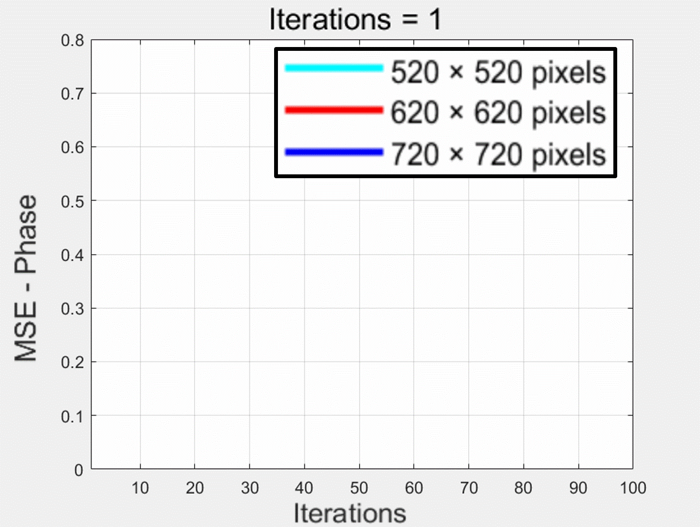
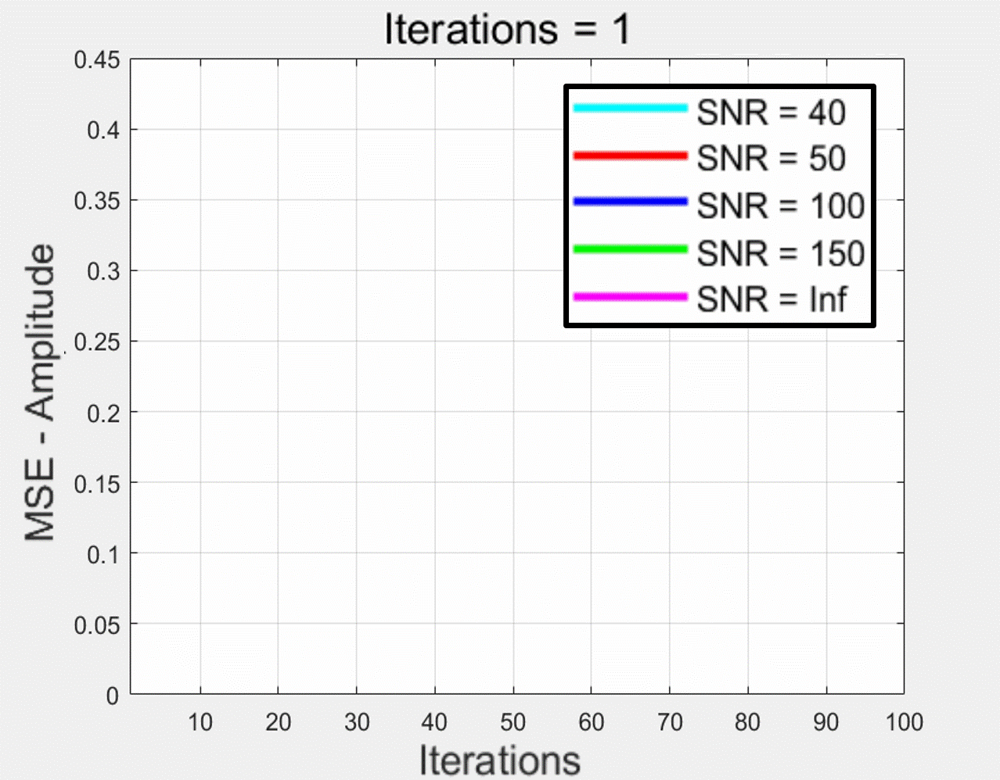
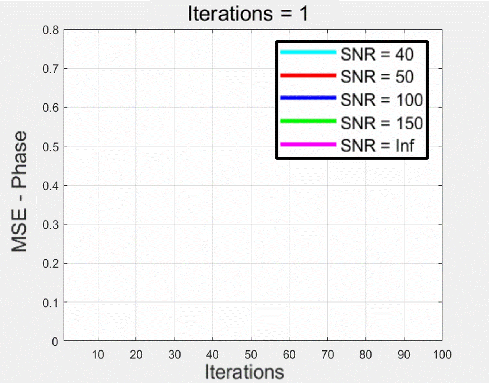

<h1> Quantum holography enhanced by object-uncorrelated photons </h1>

**[Yiqian Yang](https://scholar.google.com/citations?user=98z1r7MAAAAJ&hl=zh-TW&oi=ao)** and **[Liangcai Cao](https://scholar.google.com/citations?user=FYYb_-wAAAAJ&hl=en)**

:school: ***[HoloLab](http://www.holoddd.com/)**, Tsinghua University*

This work demonstrates a quantum holography approach that leverages spatial correlations of entangled photons to overcome the limitations of small detector areas, enabling high-resolution holographic reconstruction. The code numerically simulates digital holography and iterative phase retrieval, providing a computational framework to model diffraction propagation and phase retrieval, which helps illustrate how complete object information can be reconstructed from partially recorded holograms.

Reference
⦁	Yiqian Yang, Zhixiang Li, Zhengzhong Huang, Andrew Forbes, Liangcai Cao, Keyu Xia, Yanqing Lu, "Quantum holography enhanced by object-uncorrelated photons," Physical Review Applied, xxx.
⦁	https://doi.org/10.1103/b2hb-7zj5

Requirements
⦁	MATLAB R2022a or newer versions

Function
⦁	Propagator function
⦁	FT
⦁	IFT

Object+SPDC algorithm
⦁	The generalization of the algorithm is validated under different entangled photon-pair utilizations.

 &nbsp;

⦁	The robustness of the algorithm is verified in the presence of various levels of noise and loss.

 &nbsp;

Source
⦁	The simulation and experiment original measurement image

Contact
⦁	Yiqian Yang, yang-yq22@mails.tsinghua.edu.cn
⦁	Liangcai Cao, clc@tsinghua.edu.cn

